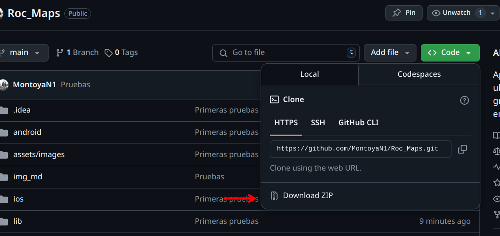

# Roc_Maps

Aplicación móvil para compartir ubicación en tiempo real, chatear con grupos familiares y planear destinos en común.


## Indicaciones de desarrollo

### Interfaz gráfica

Descarga el `ZIP` que contiene el repositorio



Ahora descomprime el archivo y editalo con tu editor o IDE favorito


### Interfaz de comandos

Clona el respositorio con:

```bash
git clone https://github.com/MontoyaN1/Roc_Maps.git
```

Accede al archivo

```
cd Roc_Maps
```

Y editalo en un IDE o editor favorito


## Consideraciones


Se requiere de tener Flutter instalado, con todas sus configuraciones de PATH y SDK necesarios, para más información o guía visita la página oficial de [Flutter](https://docs.flutter.dev/get-started/install)
